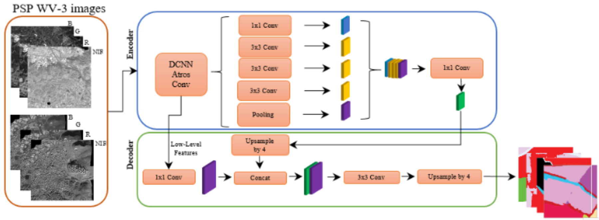
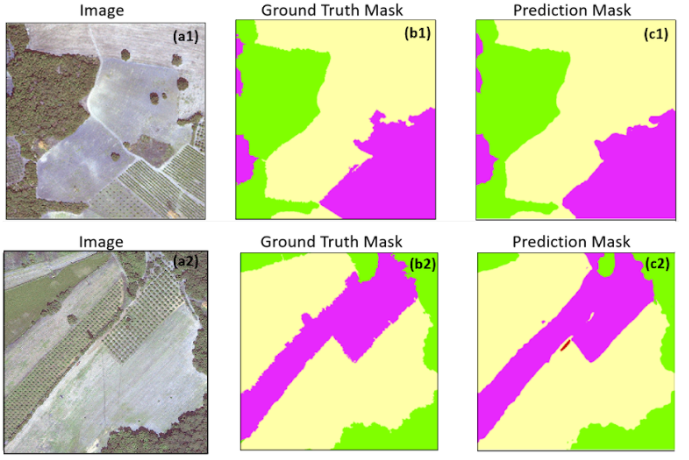
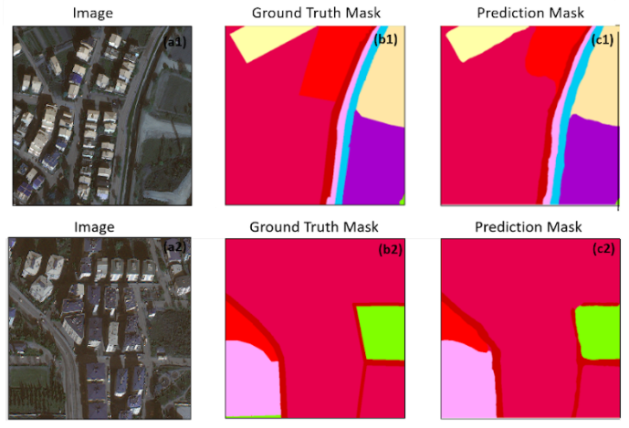
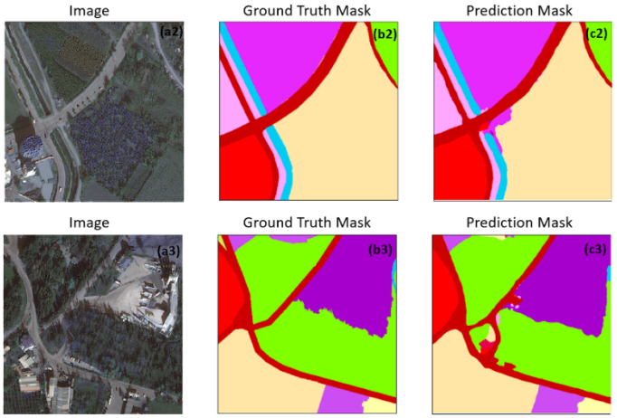

# A MULTI-TASK DEEP LEARNING FRAMEWORK FOR BUILDING FOOTPRINT SEGMENTATION
This repository contains the code for the paper [Land Use and Land Cover Mapping Using Deep Learning Based Segmentation Approaches and VHR Worldview-3 Images]([PLACEHOLDER])

Framework
---------------------
The framework of this study is detailed as follow. 

Outputs
---------------------

Dataset
---------------------
Dataset used in this study made publicly available at: [PLACEHOLDER]

System-specific notes
---------------------
The code was implemented in Python(3.8) and PyTroch(1.14.0) on Windows OS. The *segmentation models pytorch* library is used as a baseline for implementation. Apart from main data science libraries, RS-specific libraries such as GDAL, rasterio, and tifffile are also required.

Citation
---------------------
Please kindly cite our paper if this code and the dataset used in the study is useful for your research.

[PLACEHOLDER]
